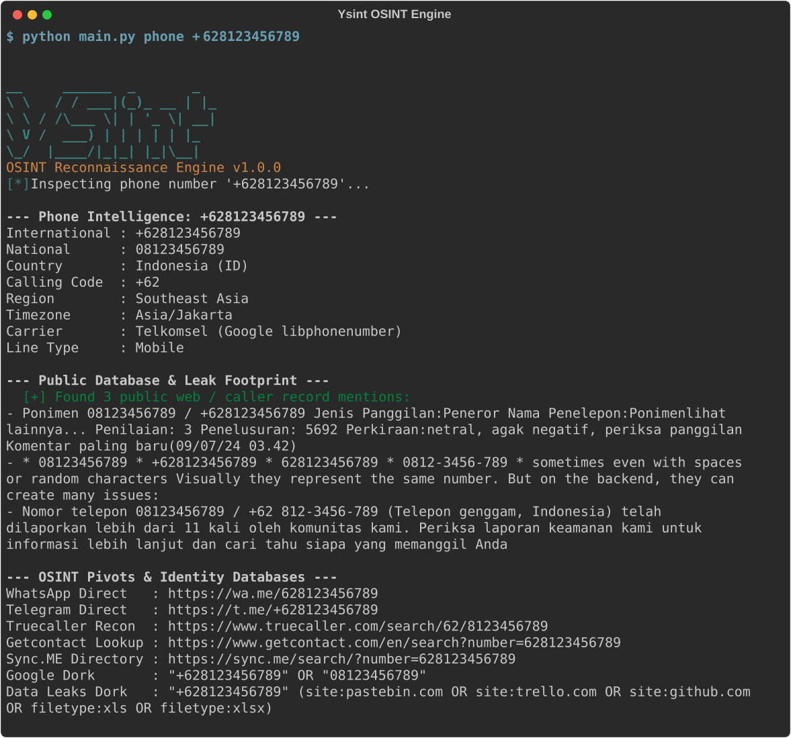

# Ysint - Modular OSINT Reconnaissance Toolkit

Toolkit Open Source Intelligence (OSINT) berbasis Python untuk melakukan footprinting dan reconnaissance terhadap nomor telepon, username, domain, alamat IP, email, dan subdomain secara komprehensif dengan dukungan pencarian database jejak publik dan validasi telekomunikasi.

## Kenapa Ini Dibuat

Investigasi jejak digital (reconnaissance) manual sering membuang waktu operasional: membuka puluhan tab browser satu per satu, mengurai record DNS mentah, menyalin data geolokasi, memetakan prefix nomor telepon internasional secara manual, dan berhadapan dengan false positive akibat respons HTTP soft-404.

Ysint dibangun untuk memberikan ringkasan intelijen yang cepat, akurat, terhubung dengan database telekomunikasi global (Google libphonenumber), dan dapat langsung diintegrasikan ke dalam pipeline keamanan melalui output JSON murni.

## Cara Kerja (Under the Hood)

- **Smart Auto-Detection**: Subcommand `scan` secara otomatis mengidentifikasi format target (nomor telepon internasional/nasional, IPv4, format email, nama domain, atau handle username) dan menjalankan alur audit yang relevan.
- **Phone Number Intelligence & Database Footprint**:
  - Integrasi database telekomunikasi resmi Google (`libphonenumber`) untuk resolusi operator global, validitas format, dan wilayah geografis.
  - Pencarian jejak database publik (*Public Database & Leak Footprint*) secara realtime dari direktori web, laporan spam/caller publik, dan rekaman kebocoran data.
  - Dukungan Live HLR API (Numverify) untuk mengecek status keterhubungan kartu SIM di jaringan seluler secara langsung.
  - Penjanaan pivot link OSINT identitas instan: Truecaller, Getcontact, Sync.ME, WhatsApp Direct, Telegram Direct, dan Google Dork dokumen bocor.
- **Username Enumeration**: Memindai target secara paralel menggunakan `ThreadPoolExecutor` di belasan platform publik dengan validasi isi respons (bukan sekadar status HTTP 200) untuk mencegah false positive.
- **Domain & DNS Intelligence**: Mengambil record DNS (A, AAAA, MX, TXT, NS, SOA) via DNS over HTTPS (DoH), menganalisis header keamanan web (HSTS, CSP, X-Frame-Options, X-Content-Type-Options), serta mengecek konfigurasi cipher suite TLS/SSL.
- **IP Intelligence & ASN**: Mendeteksi rentang IP privat/loopback/reserved secara lokal sebelum memicu jaringan, melakukan Reverse DNS (PTR), serta menarik metadata ASN dan geolokasi publik.
- **Subdomain Discovery**: Enumerasi konkuren terhadap target subdomain bernilai tinggi dengan kecepatan tinggi menggunakan DNS socket resolver.
- **Email Verification**: Memvalidasi sintaks RFC, mengecek keberadaan server penampung email (MX records), dan mendeteksi penggunaan domain email sementara (disposable/burner email).

## Quickstart & Contoh Penggunaan

Kloning repositori dan jalankan langsung:

```bash
git clone https://github.com/yanzyuyu/Ysint.git
cd Ysint
pip install -r requirements.txt
python main.py phone +628123456789
```

```text
$ python main.py phone +628123456789

[*] Inspecting phone number '+628123456789'...

--- Phone Intelligence: +628123456789 ---
  International : +628123456789
  National      : 08123456789
  Country       : Indonesia (ID)
  Calling Code  : +62
  Region        : Southeast Asia
  Timezone      : Asia/Jakarta
  Carrier       : Telkomsel (Google libphonenumber)
  Line Type     : Mobile

--- Public Database & Leak Footprint ---
  [+] Found 3 public web / caller record mentions:
    - Ponimen 08123456789 / +628123456789 Jenis Panggilan:Peneror Nama Penelepon:Ponimen...
    - Nomor (+) 628123456789 / 08123456789 statistik Terakhir dilihat...
    - Nomor telepon 08123456789 telah dilaporkan lebih dari 11 kali oleh komunitas kami...

--- OSINT Pivots & Identity Databases ---
  WhatsApp Direct   : https://wa.me/628123456789
  Telegram Direct   : https://t.me/+628123456789
  Truecaller Recon  : https://www.truecaller.com/search/62/8123456789
  Getcontact Lookup : https://www.getcontact.com/en/search?number=628123456789
  Sync.ME Directory : https://sync.me/search/?number=628123456789
```



### Perintah Utama

1. **Auto-Scan (Deteksi Otomatis Target):**
   ```bash
   python main.py scan +628123456789
   python main.py scan 085712345678
   python main.py scan yanzyuyu
   python main.py scan 8.8.8.8
   python main.py scan github.com
   ```

2. **Phone Number Intelligence (Database & Footprint):**
   ```bash
   python main.py phone +628123456789
   python main.py phone 083123456789
   python main.py phone +1-415-555-2671
   ```

3. **Username Recon:**
   ```bash
   python main.py user yanzyuyu
   ```

4. **Domain Intelligence:**
   ```bash
   python main.py domain github.com
   ```

5. **Subdomain Enumeration:**
   ```bash
   python main.py subdomains github.com
   ```

6. **IP Intelligence:**
   ```bash
   python main.py ip 1.1.1.1
   ```

7. **Email Analysis:**
   ```bash
   python main.py email test@mailinator.com
   ```

8. **Pipeline Automation (Format JSON Murni):**
   ```bash
   python main.py phone +628123456789 --json
   python main.py scan target --json -o report.json
   ```

## Struktur Proyek

```
ysint/
├── .gitignore             # Aturan ignorasi cache dan file sensitif
├── main.py                # Entrypoint eksekusi aplikasi
├── README.md              # Dokumentasi teknis proyek
├── requirements.txt       # Dependensi library
├── terminal_demo.svg      # Snapshot visual eksekusi terminal
├── tests/
│   ├── __init__.py
│   └── test_modules.py    # Unit test modul OSINT
└── ysint/
    ├── __init__.py        # Metadata versi paket
    ├── cli.py             # Parser CLI dan formatted reporter
    ├── utils.py           # Utilitas jaringan, SSL context, dan validator
    └── modules/
        ├── __init__.py
        ├── domain.py      # DNS DoH, SSL inspection, security headers
        ├── email.py       # Syntax, MX check, disposable detection
        ├── ip.py          # IP intelligence, ASN, reverse DNS
        ├── phone.py       # Google libphonenumber, database footprint, OSINT pivots
        ├── subdomain.py   # Resolusi konkruen subdomain
        └── username.py    # Multi-platform username hunting
```

## Pengujian Unit

Jalankan rangkaian test otomatis bawaan:

```bash
python -m unittest discover tests
```
